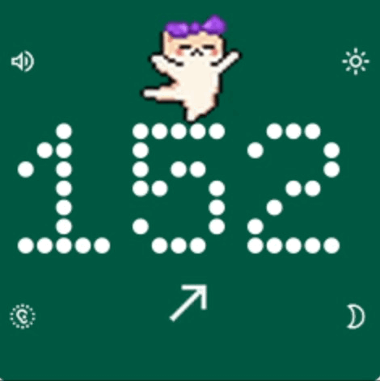

# Nightscout Display

A Raspberry Pi-powered glucose monitor display using Nightscout, designed for Pirate Audio HAT and Raspberry Pi Zero 2 W.



## Features
- Glucose readings from Nightscout
- Visual trend indicators and status colors
- Alarm for critical levels
- Brightness and volume controls
- Animated status indicators

## Installation

### Hardware:
- [Raspberry Pi Zero 2 W](https://www.raspberrypi.com/products/raspberry-pi-zero-2-w/)
- [Pirate Audio HAT](https://shop.pimoroni.com/products/pirate-audio-mini-speaker?variant=31189753692243)

You will need to either install headers on your Pi Zero 2 W or buy it pre-installed. Seat the Pirate Audio HAT on the header pins firmly.

### Operating System

* Install & Configure [Raspberry Pi OS Lite 32 bit](https://www.raspberrypi.com/software/operating-systems/) using [Raspberry Pi Imager](https://www.raspberrypi.com/software/)

### Boot config
Add to `/boot/firmware/config.txt`
```
# Pirate Audio
dtoverlay=hifiberry-dac
gpio=25=op,dh
```

Uncomment these lines from `/boot/firmware/config.txt`
```
dtparam=i2c_arm=on
dtparam=spi=on
```

### Dependencies
```
sudo apt update
sudo apt upgrade
sudo apt install libjpeg-dev zlib1g-dev liblgpio-dev swig libfreetype6-dev mpg123
```

### Run the display

1. Install uv `curl -LsSf https://astral.sh/uv/install.sh | sh`, run `exec $SHELL` to restart your shell
2. Clone the repo
3. Create a `config.ini` file in the root directory of the project. Set the `base_url` to point to your hosted nightscout project.
  ```
  [nightscout]
  base_url = https://website-with-nightscout-api.com
  ```
4. `uv run --no-dev -m src.main`

### Run the display as a service

To run the display permanently, create a new service `sudo vim /etc/systemd/system/nightscout-display.service`
```
[Unit]
Description=Nightscout Display
After=network.target

[Service]
ExecStart=${uv-path} run --no-dev -m src.main
WorkingDirectory=/home/${user}/nightscout-display
StandardOutput=inherit
StandardError=inherit
Restart=always
RestartSec=3

[Install]
WantedBy=multi-user.target
```

`sudo systemctl daemon-reload && sudo systemctl enable nightscout-display.service && sudo systemctl start nightscout-display.service`

Follow the logs with `sudo journalctl -u nightscout-display.service -f`

## Local Development

Install uv with your preferred method (or the same way as in "Run the display")

Run the app with `uv run -m src.main`

Outside of a raspberry pi, this will use PyGame to create the window.

You can use keys 1-4 to simulate the controls buttons.

## Pre-commit

Run `uv run pre-commit install` to install pre-commit hooks

## Typecheck, Linting, Formatting

`uv run mypy . && uv run ruff check --fix && uv run ruff format`

## Unit Testing

`uv run pytest`
